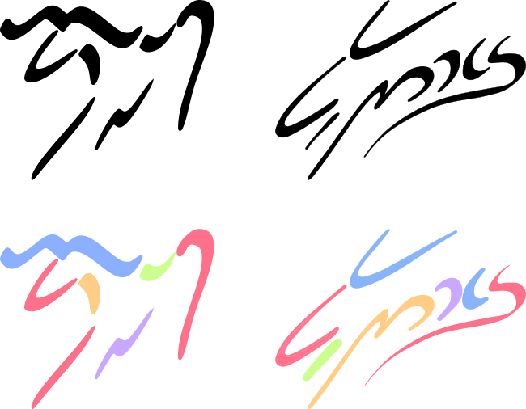
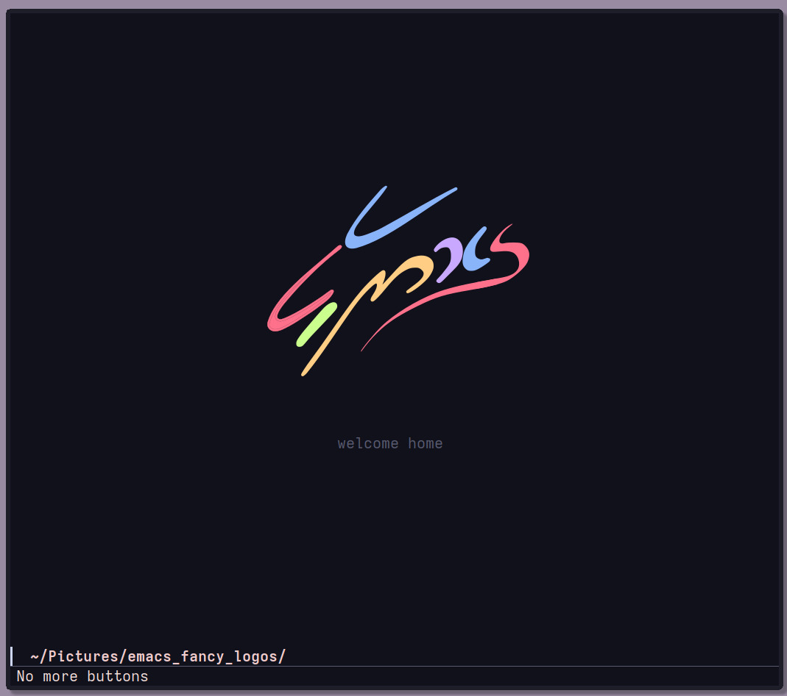

# Emacs Fancy Logos

This repo contains just a few Emacs and GNU logos that I have adapted from original sources to vector graphics.





### Why?

Looking over the [design of the Emacs
logo](https://www.ecb.torontomu.ca/~elf/emacs/logo/logo.html), I noticed the
logo designed for [XEmacs](https://www.xemacs.org/) that I quite liked, however
could only find a single initial image of it's design from a draft proposal
stage. I wanted to convert it to a higher quality vector graphic, as blurry
images is a pet peeve of mine. I also really like the GNU logo that was created
by
[TanbinIslam43](https://github.com/TanbinIslam43/mydotfiles/tree/main/.doom.d)
that was recently highlighted by
[Xenodium](https://xenodium.com/my-emacs-eye-candy/) as part of his splash
screen. This image is also as a small png, so I wanted to recreate it as a
vector graphic so have supplied that here as well.


I have supplied the images in black and white and color images using the palette
from
[TanbinIslam43](https://github.com/TanbinIslam43/mydotfiles/tree/main/.doom.d).
If you want to play around with the color schemes or make any changes, feel free
to fork this or make a pull request and maybe we can add a few more colorways
in. Also if anyone wants to tidy them up and make them even nicer, please feel
free. I am probably the furthest thing from a graphic designer with visual
artistic skills approaching zero, so if anyone wants to improve them please feel
free to open a PR as well.

### How I made them and how you could edit them

These logos were made in Inkscape by just tracing the XEmacs logo from
[XEmacs](https://www.xemacs.org/) and the GNU logo using TanbinIslam43's color
palette. The logos were just traced using bezier curves. If you want to edit
them or improve them, the SVG files should open in Inkscape where you could
edit/improve them to your hearts content. Any drama, just let me know.


### My Splash Screen

I use doom, so I just modified the Doom splash screen to show my image and get
rid of pretty much everything else.

``` emacs-lisp
  (setq fancy-splash-image "<PATH_TO_REPO>/emacs_fancy_logos/xemacs_color.svg")
  (setq +doom-dashboard-menu-sections nil)
  (defun doom-dashboard-widget-shortmenu ())
  (defun doom-dashboard-widget-footer ())
  (defun doom-dashboard-widget-loaded ()
  (when doom-init-time
    (insert
     ""
     (propertize
      (+doom-dashboard--center
       +doom-dashboard--width
       "welcome home")
      'face 'doom-dashboard-loaded)
     "\n")))

```

### Licence

Given these are all part of the GNU/Emacs and XEmacs domains, all of these
images are licensed under GPL.
